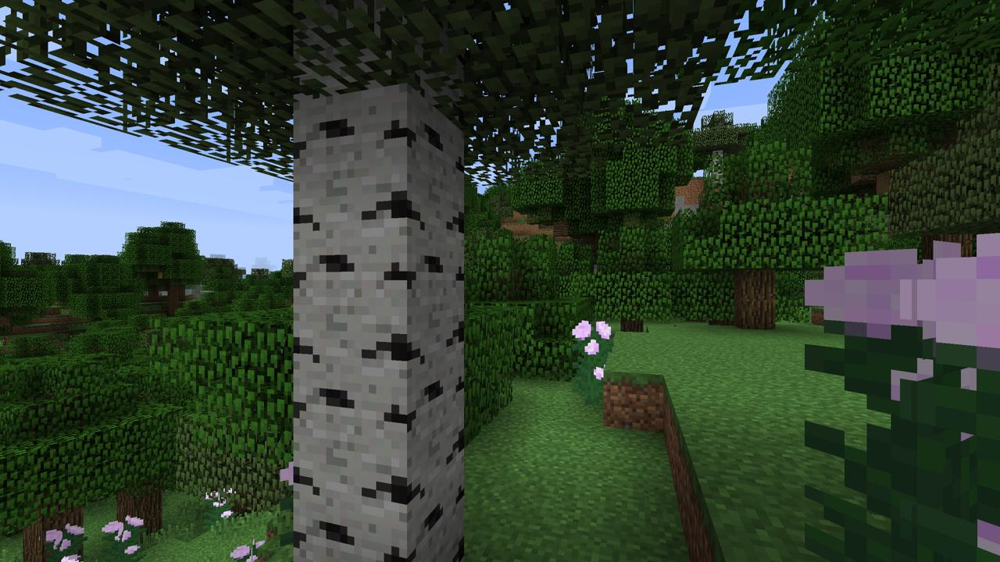

# Biome Detector  

## Network  
TODO

## Scraping  


Data scraping for the project was performed using the script ```screenbot.py``` in ```scraping/```. ```screenbot.py``` works using the macro library pyautogui to teleport the player randomly around the Minecraft world via the ```/spreadplayers``` command. The player then turns in a circle, taking screenshots of the world. By using [TheRedEngineer's biome detector datapack](http://www.theredengineer.com/biome-detector.html) and tracking Minecraft's ```latest.log``` logfile, the script is able to then process, label, and save the images for training.

### Usage  
1. Create a new minecraft installation directory for the Minecraft version 1.13.1
2. Create a new world in that version with default terrain generation
3. In the ```datapacks``` directory for the new world, install [TheRedEngineer's biome detector datapack](http://www.theredengineer.com/biome-detector.html)
4. Type the following commands in Minecraft to enable biome detection:  
    ```/scoreboard objectives add playerBiome dummy```  
    ```/scoreboard objectives setdisplay sidebar playerBiome```
5. Run the ```screenbot.py``` script with the required parameters set. For information on the script's usage, run ```py screenbot.py -h```  
6. Once you have set up your game for data collection, in the Minecraft chat window type "start" and hit enter to start collecting data.  
    Ensure that the game is kept on top level focus for the duration of the run, as the macro commands run by the script could have unintended affects otherwise.

### Data Collection Parameters  
Images in the training dataset were taken with these parameters applied:
 - Minecraft version 1.13.1
 - Render distance set to 8 chunks
 - Default terrain generation
 - Game in peaceful mode
 - Player in creative mode
 - GUI hidden (f1 mode)
 - Game time set to 6000 (daytime) using  
    ```/time set 6000```  
    ```/gamerule doDaylightCycle false```
 - Player camera angled level with horizon (imperfectly by hand)